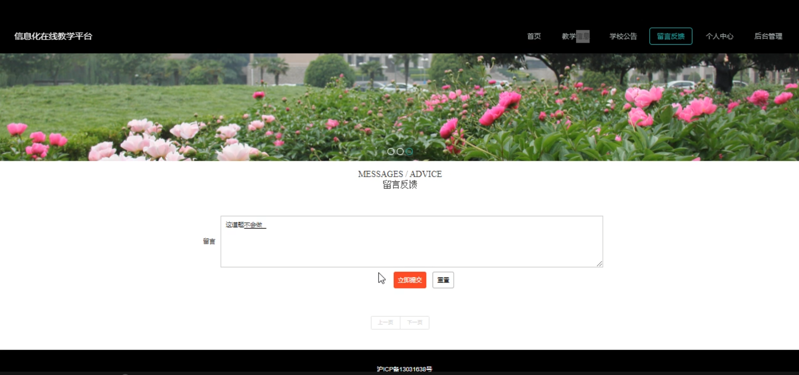

# 基于springboot的信息化在线教学平台

#### 介绍

在数字化时代，教育领域也在不断探索创新的教学模式和方法。本基于 Spring Boot 的信息化在线教学平台应运而生，旨在打破时间和空间的限制，为教育教学提供更高效、便捷和丰富的体验，促进教育资源的公平分配和有效利用。

#### 技术栈

后端技术栈：Springboot+Mysql+Maven

前端技术栈：Vue+Html+Css+Javascript+ElementUI

开发工具：Idea+Vscode+Navicate

#### 系统功能介绍

（一）管理端  
个人中心：管理端人员可以查看和修改个人信息，接收重要通知和消息。  
学生管理：对学生的个人信息、学习情况进行全面管理，包括学生的注册审核、信息更新、班级分配等。  
教师管理：负责教师的信息登记、资质审核、教学任务分配以及工作绩效评估等。  
教学信息管理：制定和调整教学计划、课程安排、教材选用等教学相关的重要信息。  
学生成绩管理：录入、查询和分析学生的考试成绩，为教学质量评估和学生的学业发展提供数据支持。  
留言板管理：审核和回复学生、教师在留言板上的留言，及时解决问题和处理反馈。  
系统管理：进行系统的参数设置、权限分配、数据备份与恢复、安全监控等关键操作，确保系统的稳定运行和数据安全。  

（二）教师端  
教学信息：查看详细的教学计划、课程安排和教学要求，以便有针对性地备课和授课。  
学校公告：及时了解学校的重要通知、政策调整和活动安排。  
留言反馈：向管理端反映教学过程中遇到的问题，提出改进建议，与学生进行互动交流。  
个人中心：修改个人资料，设置教学偏好和通知提醒方式。  
后台管理  
教学信息管理：根据实际教学情况对教学内容进行调整和补充。  
学生成绩管理：录入学生的平时成绩、作业成绩和考试成绩，进行成绩分析和统计。  
留言板管理：回复学生的留言，与学生进行在线沟通和辅导。  
（三）学生端  
教学信息：获取课程大纲、教学课件、作业布置等详细的教学资料。  
学校公告：了解学校的各类通知，如放假安排、活动通知等。  
留言反馈：向教师和管理端提出问题和建议，反映学习中的困难和需求。  
个人中心：修改个人基本信息，查看学习记录和成绩报告。  
后台管理  
学生成绩管理：查看自己的各科成绩、成绩排名和成绩走势，了解学习状况。  

#### 系统作用

优化教学管理流程  
为管理端提供了全面、高效的管理工具，实现对学生、教师和教学资源的集中管理和优化配置。  
提高了教学管理的准确性和及时性，减少了人工操作的失误和繁琐。  
提升教学质量  
教师能够通过平台更方便地准备教学内容，与学生互动交流，及时了解学生的学习情况并调整教学策略。  
学生可以获取丰富的学习资源，按照自己的节奏学习，提高学习的自主性和效果。  
增强师生互动与沟通  
留言反馈功能和留言板管理促进了师生之间的问题解决和信息交流，营造了良好的教学氛围。  
学校公告确保了信息的及时传递，使师生能够同步了解学校的重要动态。  
促进教育公平  
在线教学平台打破了地域和时间的限制，让更多学生能够享受到优质的教育资源。  
成绩管理和教学信息管理有助于教师关注到每个学生的学习情况，实现个性化教育。  

#### 系统功能截图

代码结构

数据库表

登录

前台页面首页

教师信息

学校公告

留言反馈

个人中心

教师端后台管理

学生成绩管理

管理员端学生管理

教师管理

#### 总结

本基于 Spring Boot 的信息化在线教学平台，通过合理的角色分工和功能模块设计，构建了一个集教学管理、教学实施和学习支持于一体的综合性教育环境。它不仅提高了教育教学的效率和质量，还为师生之间的互动交流和个性化学习提供了有力的支持。在未来的发展中，该平台将不断适应教育领域的新需求和新技术，持续优化和完善功能，为推动教育信息化的发展发挥更大的作用。

#### 使用说明

创建数据库，执行数据库脚本 修改jdbc数据库连接参数 下载安装maven依赖jar 启动idea中的springboot项目

后台地址：http://localhost:8080/springboot9qw88/admin/dist/index.html

管理员  abo 密码 abo

前台地址：http://localhost:8080/springboot9qw88/front/index.html

